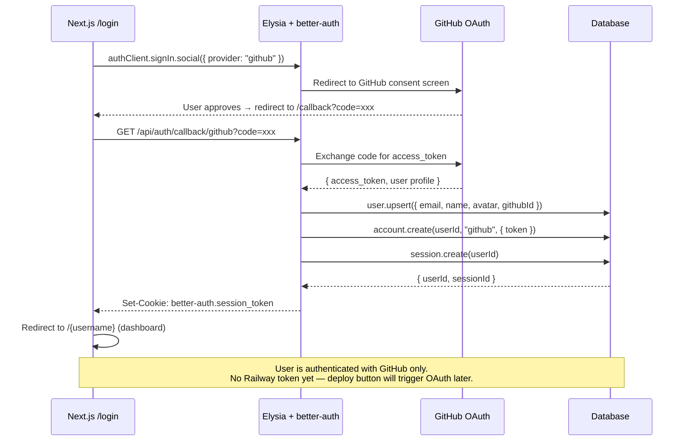
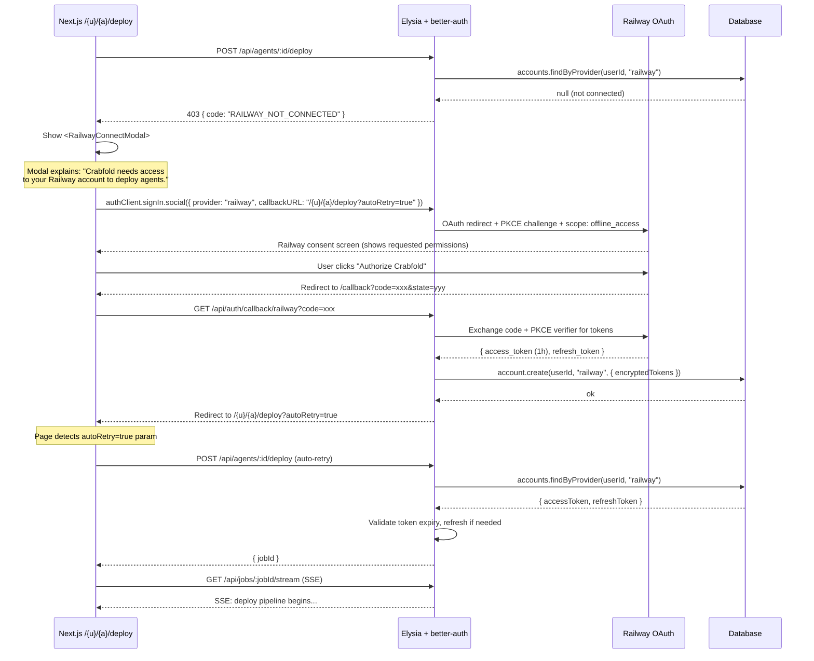
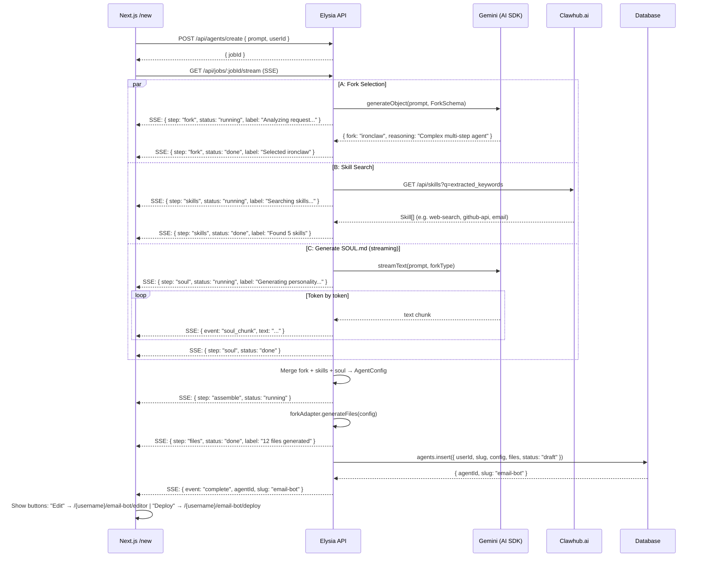
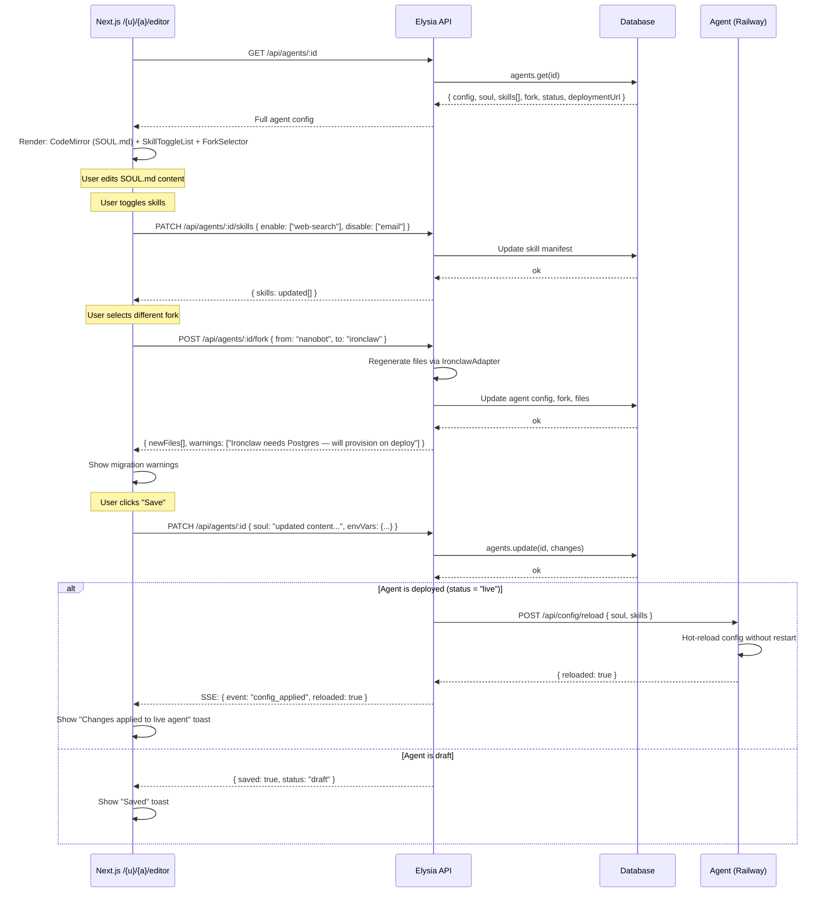
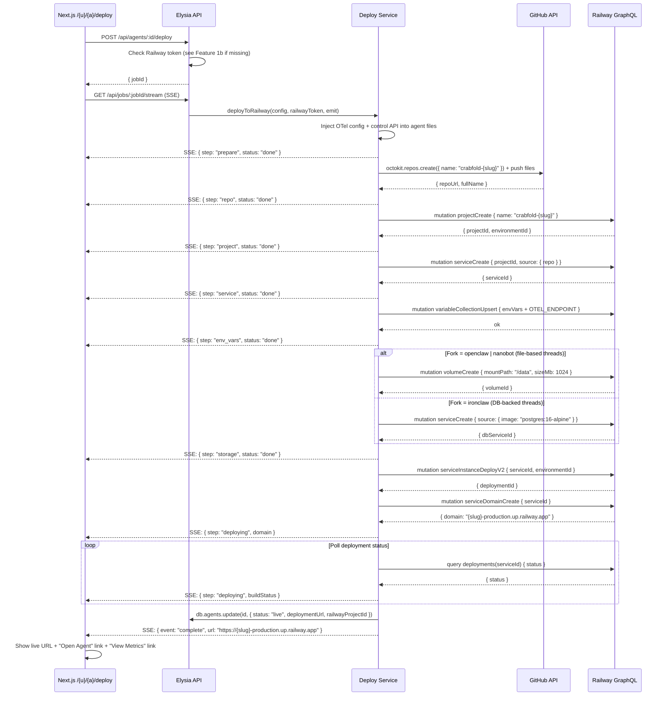
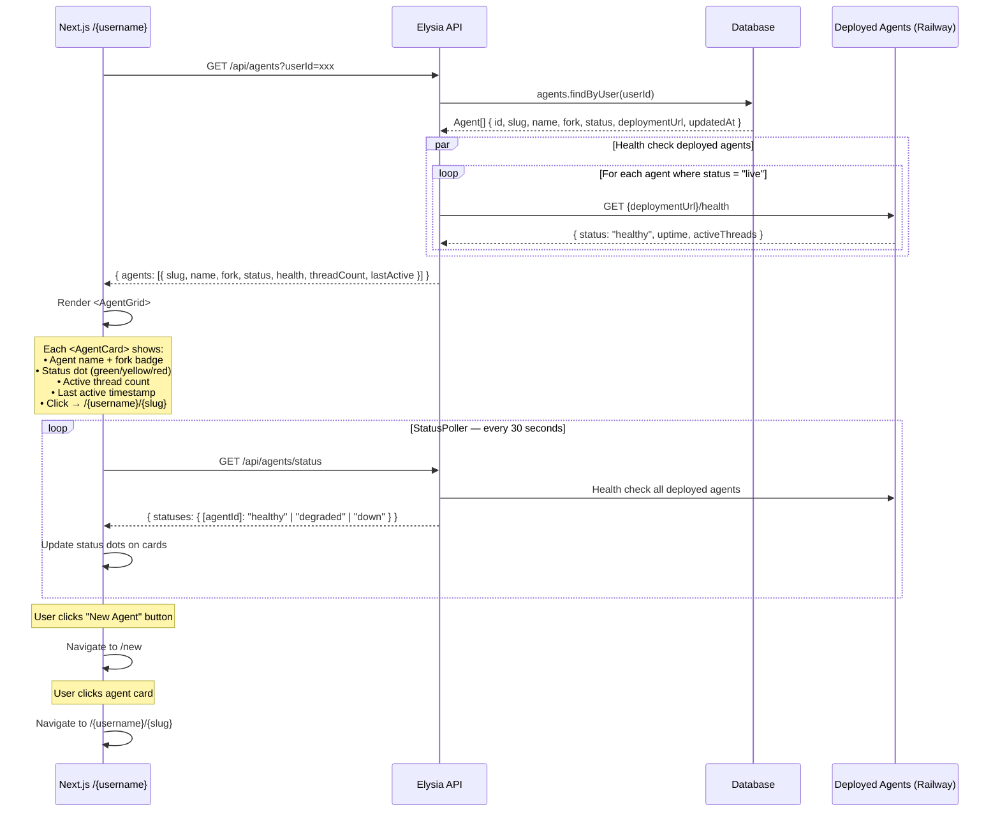
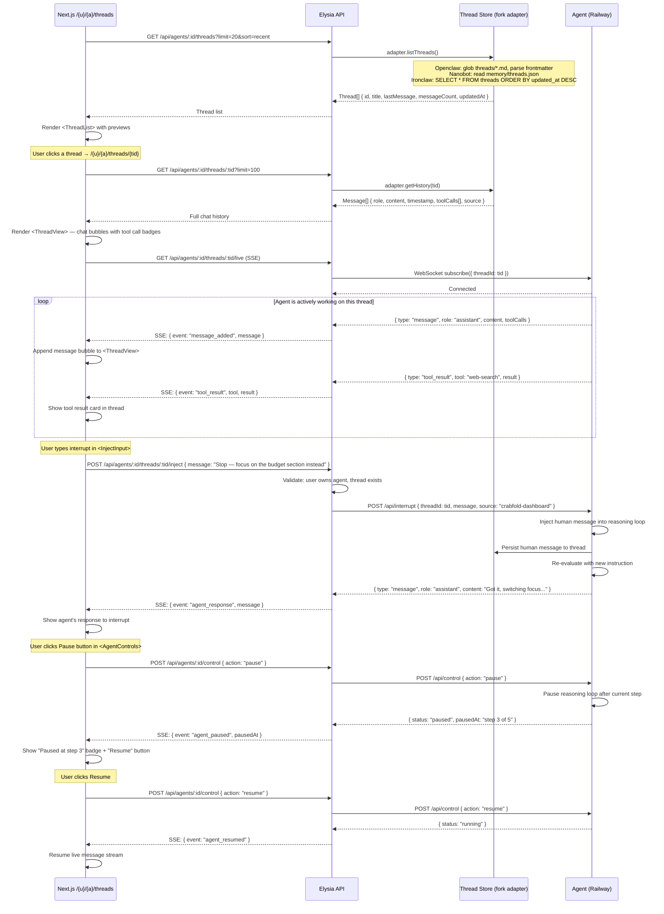
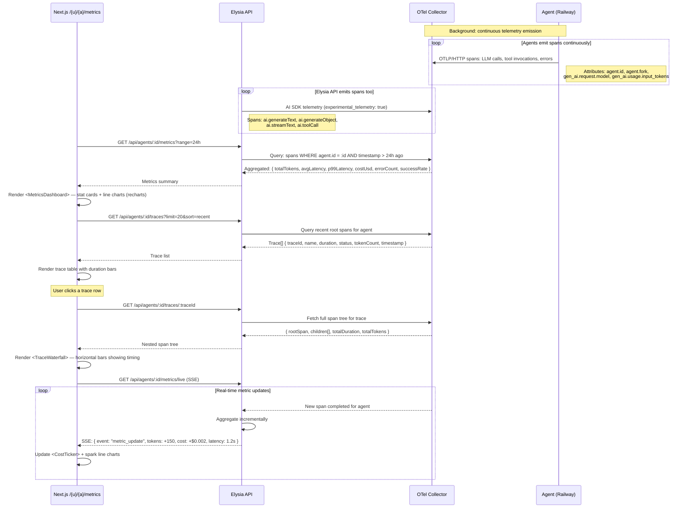
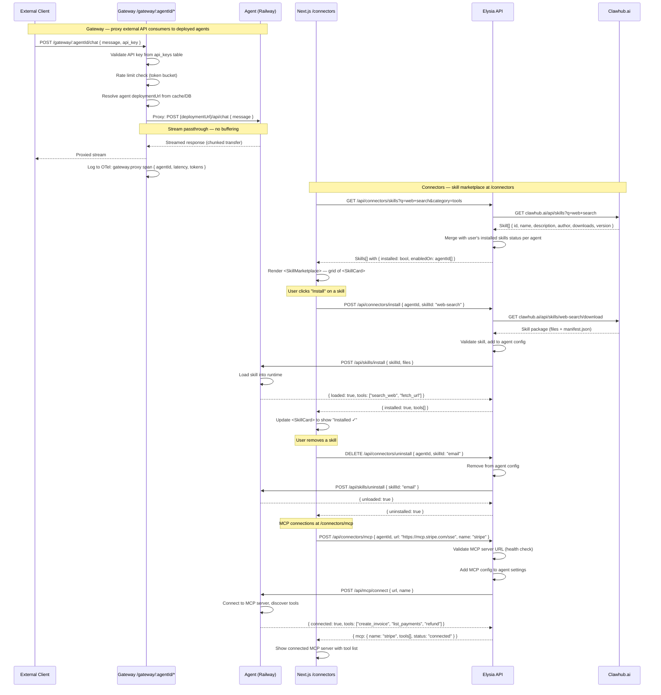

# Crabfold — Sequence Diagrams (Vercel-style routes)

## Feature 1a: Sign in with GitHub (better-auth)

## Feature 1b: Lazy Railway OAuth (on first deploy)

## Feature 2: Scaffold Agent (live progress at /new)

## Feature 3: Visual Editor (/{u}/{a}/editor)

## Feature 4: Deploy to Railway (/{u}/{a}/deploy)

## Feature 5: Dashboard (/{username})

## Feature 6: Threads + Interrupt (/{u}/{a}/threads)

## Feature 7: Observability (/{u}/{a}/metrics)

## Feature 8: Gateway + Connectors (/gateway, /connectors)

